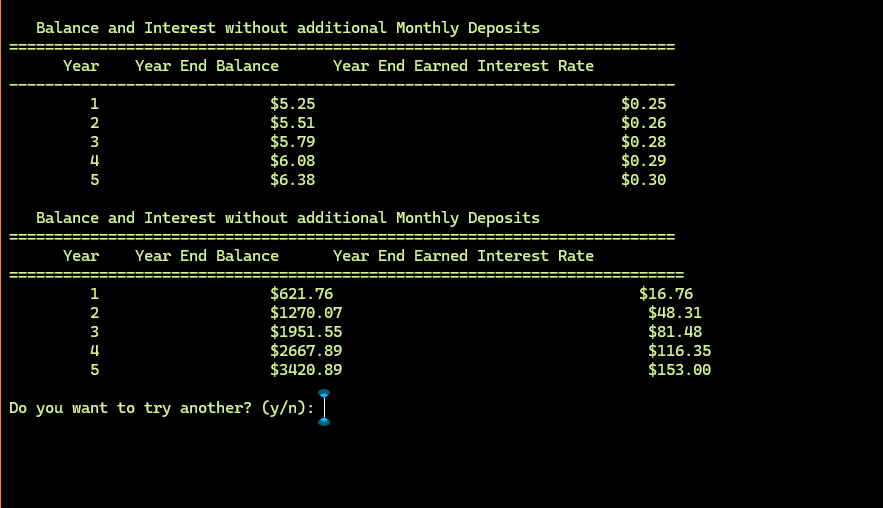

# CS-210 Portfolio
CS-210 Projects

## [Project 1 - Clock App](Project%201%20-%20Clock%20App)
A 12 and 24-hour console clock app written in C++.

Display 12-hour clock format where the clock does not exceed 12:59:59, display 24-hour clock format where the clock does not exceed 23:59:59,
and both clocks will synchronously  display the host current time in a proper format.

## [Project 2 - Investment Banking App](Project%202%20-%20Investment%20Banking%20App)
Investment and compound interest console app written in C++.

An application that allows user to see how their investment will grow over time.
A screen that takes initial investment amount, monthly deposit, annual interest (compound) and number of years.

The screen displays two static reports: the first shows year-end balances and earned interest if no additional monthly deposits are made, while the second shows year-end balances and earned interest based on the monthly deposit value entered by the user (e.g., $50.00). See below:

## What I did particularly well.
I successfully incorporated a user interface that includes all the required elements. I designed a calculator that computes monthly interest, annual interest rate, and divides the rate by 12. Below is the code to calculate the interest earned over a given year.

    int currentyear = 1;

    double yearendBalance = this->initialDeposit;

    while (currentyear <= this->numYears) {

        //calulate interest monthly and find compoud interest

        int month = 1;

        double interestearned = 0.0;

        double monthendbalance = yearendBalance;

        while (month <= 12) {

            //Add monthly deposit

            monthendbalance += this->monthlyDeposit;

            //Calculate monthly interest, interest rate is for annual. so divide the rate by 12

            double monthlyinterest = monthendbalance * this->interestRate / (100 * 12);

            //Add the monthly interest to yearly interest earned

            interestearned += monthlyinterest;

            // add the interest to monthend balance

            monthendbalance += monthlyinterest;

            //Increase the month by 1

            month++;

        }

## Where I could enhance this code and how this will improve the efficeinecy and security
I think the code could have used error handling to effectively validate user input

## Challanges I faced when writing the code, how I overcome them and tools or resources I added to my support network
There weren't many roadblocks during the development of my code; however, I did encounter some confusion when designing the .h header file, as it was one of my first experiences including a header file in a C++ program. I sought help from the academic support service, where they provided a detailed explanation of how to include header files. I learned that, according to standard coding practices, classes should be declared in the header file and defined later in the source code.

## Skills I learned from this project that is tranferable to other projects or course work
From this project, I gained valuable skills, including properly including .h files, declaring functions correctly, and performing the necessary calculations during code development. Throughout this course, I also learned how to integrate C++ with Python. Although it took time to fully grasp, I can now easily reference file paths and configure settings as needed or specified.
