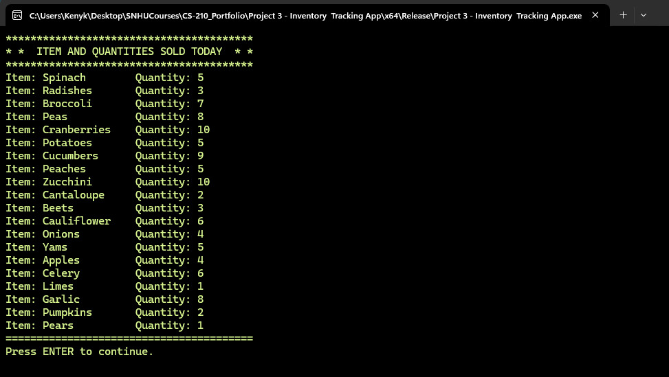

# CS-210 Portfolio
CS-210 Projects

### [Project 1 - Clock App](Project%201%20-%20Clock%20App)
A 12 and 24-hour console clock app written in C++.

Displays a 12-hour clock format, ensuring the time does not exceed 12:59:59, and a 24-hour clock format, ensuring the time does not exceed 23:59:59. Both clocks will synchronously display the host's current time in the correct format.


### [Project 2 - Investment Banking App](Project%202%20-%20Investment%20Banking%20App)
Investment/compound interest console app written in C++.

An application that allows users to see how their investment will grow over time. The screen prompts for the initial investment amount, monthly deposit, annual compound interest rate, and number of years.


The screen displays two static reports: the first shows year-end balances and earned interest if no additional monthly deposits are made, while the second shows year-end balances and earned interest based on the monthly deposit value entered by the user (e.g., $50.00). See below:


[Project 2 Flowchart](docs/Project%202%20Flowchart.pdf)


### [Project 3 - Inventory Tracking App](Project%203%20-%20Inventory%20%20Tracking%20App)
Inventory tracker console app written in C++ and Python.


The application reads a text-based file containing a list of purchased items for a single day, with each item listed each time it is sold. It generates a list of all items sold that day, including the number of times each item was sold. Additionally, it displays the count of purchases for each specific item and produces a text-based histogram showing all items purchased, along with a visual representation of the purchase frequency. See below:

  
 
[Project 3 Programming Languages Explanation](docs/Project%203%20Programming%20Language%20Explanation.pdf)

### What I did particularly well in project 3.
Designed an integrated interface that includes all the essential elements. I designed a calculator that computes both monthly interest and the annual interest rate, which is then divided by 12. In this repository, you’ll find the code to calculate the interest earned over a specified number of years.

### Challanges I faced when writing the code and how I overcome them.
During the development and integration of my sources, I encountered minimal roadblocks. However, I faced some challenges when designing the .h header files, as it was nearly my first experience including header files in a C++ program. To address this, I sought assistance from the academic support service, where I learned the fundamentals of header files.

Here are the key insights I gained during this process:

- Purpose of Header Files: Header files (.h) are used to declare classes, functions, and variables, providing an interface for other parts of the program.
- Separation of Declaration and Definition: In C++, it is standard practice to declare classes and their methods in the header files and define them later in the source code (.cpp files).

```zsh
double monthendbalance = yearendBalance;

while (month <= 12) {
    // Add monthly deposit
    monthendbalance += this->monthlyDeposit;

    // Calculate monthly interest. The interest rate is annual, so divide by 12
    double monthlyinterest = monthendbalance * this->interestRate / (100 * 12);

    // Add the monthly interest to yearly interest earned
    interestearned += monthlyinterest;

    // Add the interest to monthend balance
    monthendbalance += monthlyinterest;

    // Increase the month by 1
    month++;
}
```


##### Where I could enhance this code and how this will improve the efficeinecy and security
The code could have used error handling to effectively validate user input

### Challanges I faced when writing the code, how I overcome them and tools or resources I added to my support network
While the development of my code went smoothly overall, I did encounter some confusion when designing the .h header file, as this was one of my first experiences with header files in a C++ program. I sought assistance from the academic support service, which provided a detailed explanation of how to include header files. I learned that, according to standard coding practices, classes should be declared in the header file and defined later in the source code.

### Skills I learned from this project that is tranferable to other projects or course work
From this project, I gained valuable skills, including properly including .h files, declaring functions correctly, and performing the necessary calculations during code development. Throughout this course, I also learned how to integrate C++ with Python. Although it took time to fully grasp, I can now easily reference file paths and configure settings as needed or specified.
